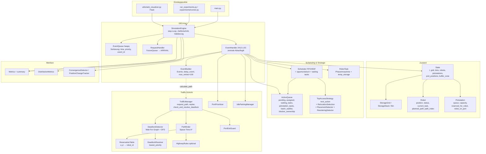
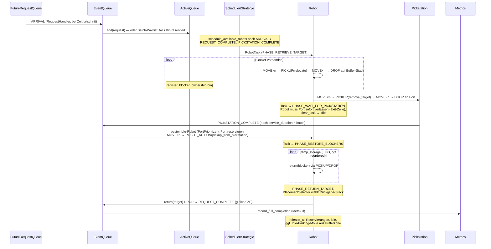

# Architektur-Karte: Compact Storage Simulation

Stand: 2026-08-15. Reine Analyse — es wurde kein Code verändert.
Basis: Vollständige Lektüre von `simulation/`, `traffic/`, `state/`, `strategies/`, `requests_/`, `metrics/`, `utils/web_visualizer.py`, Config und Test-Übersicht.

---

## 1. Gesamtarchitektur (Schichten)



Wichtige Konstruktion: `SimulationEngine.__init__` verdrahtet alles; `State` hält Referenzen auf `reservation_table` und `traffic_manager`, so dass der `EventHandler` und das `ActionCostModel` über den State an die Traffic-Schicht kommen.

---

## 2. Event-System

| EventType | Priorität | Erzeugt von | Behandelt in |
|---|---|---|---|
| `REQUEST_COMPLETE` | 0 | `_update_task_after_successful_return` (gleicher Zeitschritt wie Target-Return) | `_handle_request_complete` |
| `PICKSTATION_COMPLETE` | 1 | `_try_start_pickstation_service` | `_handle_pickstation_complete` |
| `ARRIVAL` | 2 | RequestHandler | `handle` → `ActiveQueue.add` |
| `ROBOT_ACTION` | 3 | nur noch für `pickup_from_pickstation` (+ Legacy) | `_handle_robot_action` |
| `ROBOT_PICKUP` / `ROBOT_DROP` | 3 | Zwei-Phasen-Flow | `_handle_robot_pickup` / `_handle_robot_drop` |
| `ROBOT_MOVE` | 4 | Pfadplanung (pro Zelle ein Event) | `_handle_robot_move` |

`Event.retry_count` + `EventBuilder.delay_event` (delay 1 ZE) ist der zentrale Retry-Mechanismus; bei > 100 Retries harter `RuntimeError`.

### Zwei Generationen von Ablauflogik (wichtig!)

- **Aktiv (neu, Zwei-Phasen):** `schedule_available_robots` (Z. 2204) und `_schedule_next_action_for_task_new` erzeugen für `relocate` / `remove_target` / `return`: MOVE×n → `ROBOT_PICKUP` → MOVE×n → `ROBOT_DROP`. Bin wird beim Pickup physisch aus dem Stack genommen (`in_transit=True`, `stack=None`) und beim Drop abgelegt.
- **Aktiv (alt, nur noch für Port-Abholung):** `_handle_pickstation_complete` baut über `build_path_events` MOVE×n → `ROBOT_ACTION(pickup_from_pickstation)` → `_handle_robot_action` → Executor.
- **Legacy/tot:** `_schedule_next_action_for_same_task` (Z. 2055, kein Aufrufer), `_create_plan` in TopAccessStrategy, `build_events_from_plan`, zweite (auskommentierte) Fassungen von `handle` und `schedule_available_robots` als String-Blöcke, doppelte identische Definition von `_update_task_after_successful_action_new` (Z. 853 und 881 — Python nimmt die zweite).

---

## 3. Datenfluss: Lebenszyklus eines Requests



Besonderheiten im Fluss:

- **Batching:** Requests auf eine bereits reservierte Bin landen in `_batch_waitlist` und werden beim `remove_target`-Drop an den Task gehängt (gemeinsame Servicezeit, gemeinsamer Completion-Zeitpunkt).
- **Blocker-Ownership:** `ActiveQueue._blocker_ownership` sperrt Blocker-Bins global; opportunistischer Ownership-Transfer im Scheduler möglich (Request übernimmt eine oben liegende Blocker-Bin).
- **Opportunistisches Scheduling:** Requests, deren Target-Bin bereits oben liegt, werden vorgezogen.
- **Engine-Loop:** `step()` verarbeitet genau ein Event; Zeit springt nur vorwärts, wenn kein fälliges Event existiert. Alle 10 ZE: `reservation_table.cleanup_before(t)`; der periodische Deadlock-Check läuft **nur im Zweig „EventQueue leer"** (s. Abschnitt 5).

---

## 4. Movement-Pipeline

### 4.1 Planungszeit

```
EventHandler / Scheduler
  → ActionCostModel.calculate_path(from, to, robot, state, t)
      → TrafficManager.request_path (falls state.traffic_manager vorhanden)
          → 3 Versuche mit Startzeit t, t+1, t+2:
              Pathfinder.find_path  (Space-Time-A*: Knoten (x,y,t), Warten erlaubt,
                                     Reservierungen + Head-on-Checks + Highway-Penalty + blocked_cells)
              PortExitGuard.validate_path_for_ports  (Pfad darf Port nicht "einschließen")
              ReservationTable.reserve_path  (atomar; bei Konflikt → DeadlockDetector.register_wait)
      → FALLBACK bei None: einfacher Manhattan-Pfad OHNE Reservierung  ⚠
  → robot.set_path(path); pro Zelle ein ROBOT_MOVE-Event zu festen Zeitpunkten
```

⚠ Der Manhattan-Fallback in `ActionCostModel.calculate_path` (Z. 224 ff.) umgeht die komplette Reservierungslogik. Solche Pfade sind nur noch durch die Laufzeit-Checks in `_handle_robot_move` geschützt.

### 4.2 Ausführungszeit — Prüfkaskade in `_handle_robot_move`

Reihenfolge pro Move-Event:

1. **PS-Zellen-Check:** Steht ein anderer Robot auf der Ziel-Port-Zelle → delay; ab `retry ≥ 20` wird ein blockierender *Idle*-Robot per `_handle_robot_becomes_idle` weggeschickt.
2. **Port-Reservierung:** `Pickstation.reserve(robot_id)` muss gelingen, sonst delay (unbegrenzt bis max_retries=100 → RuntimeError).
3. **ReservationTable-Check:** `is_free(next_waypoint, t)` → sonst delay.
4. **Harte physische Kollisionsprüfung** gegen alle Robot-Positionen:
   - retry < 3 → delay,
   - retry ≥ 3 → Wartekante in DeadlockDetector registrieren, Zykluscheck, dann `_replan_path_around_obstacle` (blockierte Zelle wird beim Neuplanen gemieden),
   - retry ≥ 5 → zusätzlich `_force_stale_robot_to_replan(other)` (nur wenn dessen Aktion „not on top"-stale ist).
5. Move ausführen: alte Zelle `release(x, y, t-1)`, Position setzen, Port-`robot_enters`/`robot_leaves`-Buchhaltung, ggf. nächstes MOVE-Event (`t + move_cost`).
6. Ziel erreicht → `_cleanup_past_reservations`; Robot ohne Task → idle + Idle-Parking-Regel (raus aus Port/Pufferzone).

**Bekannte konstruktive Schwäche (beobachtet, nicht geändert):** Reservierungen werden bei Planung für feste Zeitpunkte `start_time+i` eingetragen. Sobald ein Move auch nur einmal verzögert wird, läuft der Robot seiner eigenen Reservierungs-Zeitleiste hinterher; die Tabelle schützt dann faktisch nicht mehr (Fremd-Checks prüfen falsche Zeitpunkte, `cleanup_before` räumt die veralteten Einträge ab). Der tatsächliche Kollisionsschutz ist im Bestand die physische Prüfung in Schritt 4.

---

## 5. Deadlock / Livelock / Recovery — Inventar

### 5.1 Begriffe im Code

- **Deadlock-Erkennung:** explizit — `DeadlockDetector` (Wait-For-Graph, eine ausgehende Kante pro Robot, DFS-Zyklussuche). Kanten entstehen an zwei Stellen: (a) `TrafficManager.request_path` bei Reservierungskonflikt, (b) `_handle_robot_move` bei physischer Blockade ab retry ≥ 3.
- **Livelock-„Erkennung":** implizit — es gibt keinen dedizierten Livelock-Detektor, sondern Retry-Zähler mit Eskalationsschwellen (siehe Tabelle). „Livelock" taucht nur in zwei Kommentaren auf (Z. 167, 448 im EventHandler).
- **Auflösung:** `DeadlockResolver` (Strategie `lowest_priority`: Opfer = Task mit niedrigster Priorität, Fallback höchste robot_id) + diverse lokale Recovery-Mechanismen.

### 5.2 Eskalationsleiter (alle Recovery-Pfade)

| Auslöser | Schwelle | Mechanismus | Wirkung |
|---|---|---|---|
| MOVE: ReservationTable belegt | jeder | delay +1 ZE | Retry |
| MOVE: Port nicht reservierbar | jeder | delay +1 ZE | Retry (keine Eskalation!) |
| MOVE: PS-Zelle physisch belegt | ≥ 20 | Idle-Blockierer wegparken | Zelle wird frei |
| MOVE: Zelle physisch belegt | ≥ 3 | Wait-Kante + Zykluscheck + Replan um Hindernis | neuer Pfad oder weiter delay |
| MOVE: Zelle physisch belegt | ≥ 5 | zusätzlich `_force_stale_robot_to_replan(other)` | nur wenn Gegner „stale" ist |
| PICKUP: Robot nicht an Stack-Position | ≥ 5 | Bewegung zum Pickup neu planen | Replan |
| PICKUP: Robot nicht an Stack-Position | ≥ 15 | Task requeue (`waiting_tasks`), Robot frei | harter Reset des Tasks |
| PICKUP: „not on top" | jeder | Strategie neu befragen → Replan | neue Aktionsfolge |
| ACTION (relocate) blockiert | jeder | **Smart Skip**: Bin schon woanders/weg → nächste Aktion | überspringt veraltete Relocation |
| ACTION (remove_target) blockiert | ≥ 5 | Revalidierung: Stack verändert → `temp_storage.clear()` + Replan | Neuaufbau des Relocation-Plans |
| ACTION blockiert (allgemein) | ≥ 20 (`max_action_retries_before_replan`) | Task requeue, Robot frei | Reset |
| Jedes Event | > 100 (`EventBuilder.max_retries`) | `RuntimeError` | Simulationsabbruch (letzte Verteidigung) |
| Engine, alle 10 ZE | nur wenn EventQueue **leer** | `check_and_resolve_deadlock` → Opfer: Reservierungen freigeben + Task requeue | globale Auflösung |
| REQUEST_COMPLETE | — | `release_all` + idle + Idle-Parking | Aufräumen |

### 5.3 Beobachtete Lücken zwischen Detection und Resolution

Diese Punkte erklären plausibel, warum erkannte Livelocks nicht zuverlässig aufgelöst werden (Problemgruppe 3). Alles Hypothesen aus Code-Lektüre; noch nicht durch Reproduktion belegt:

1. **Opfer wird nicht immer behandelt.** In `_handle_robot_move` (Z. 254 ff.): Wird ein Zyklus erkannt und ist das Opfer der *andere* Robot, passiert mit dem Opfer nichts (`pass`) — es wird nur der aktuelle Robot um das Hindernis herum neu geplant. `_deadlocks_resolved` zählt trotzdem hoch. Ist das Opfer der aktuelle Robot, wird nur delayed (Zustand ändert sich, Konflikt bleibt) — exakt das im Projektkontext beschriebene Anti-Pattern.
2. **Periodischer Deadlock-Check läuft praktisch nie.** Er hängt im Engine-Zweig „EventQueue leer" — in einer beschäftigten Multi-Robot-Simulation ist die Queue fast nie leer. Die einzige real greifende Auflösung ist damit die lokale in `_handle_robot_move`, und die hat Lücke 1.
3. **Wait-Kanten veralten.** `register_wait` überschreibt pro Robot die eine Kante; `clear_wait` passiert nur bei erfolgreicher Pfadreservierung oder `release_robot_reservations`. Nach lokalem Replan um das Hindernis bleibt die alte Kante stehen → Phantomzyklen möglich.
4. **Port-Warten hat keine Eskalation.** Kann ein Robot den Port nicht reservieren (z. B. weil ein anderer Robot mit Reservierung nie ankommt), delayed er bis zum harten `RuntimeError` bei retry 101.
5. **Unreservierte Manhattan-Fallback-Pfade** (Abschnitt 4.1) erzeugen genau die physischen Blockaden, die die Retry-Kaskade dann wieder abarbeiten muss — ein Livelock-Generator bei mehreren Robotern.
6. **Idle-Parking ist „soft".** Scheitert die Reservierung des Parkwegs, bleibt der Idle-Robot in der Pufferzone stehen (nur `[INFO]`-Log) und blockiert dort ggf. Port-Zufahrten, bis ihn die 20-Retry-Regel wegschickt.

---

## 6. Zuordnung zu den drei Problemgruppen

### P1 — Transit-Kisten

Lebenszyklus: `ROBOT_PICKUP` setzt `in_transit=True`, `stack=None`, `level=None`; `ROBOT_DROP` bzw. Executor setzt `mark_transit_done`. Abfragen, die Transit bereits tolerieren: Engine-`_validate_bin_uniqueness` (zählt Transit-Bins separat), `TopAccessStrategy._next_retrieve_target_action` (wartet bei `in_transit`), Scheduler-`_get_accessible_bin_ids`, Smart Skip. Verbleibende Prüfflächen für Edge Cases: alle Stellen, die `bin.get_stack()` als Tupel voraussetzen (`can_complete_consistently`, `_resolve_position`-Ketten), `pickup_from_pickstation`-Constraint (Status-Wechsel at_pickstation ↔ in_transit beim Port-Abholen), und `_find_bin_location`, das Transit-Bins als „nicht vorhanden" meldet.

### P2 — Pickstation-Summary teilweise leer

Der Summary-Pfad ist `Metrics.summary()` (Web-Visualizer liefert ihn erst bei `is_finished`). Konkrete Kandidaten für leere Felder (beobachtet, nicht gefixt):

1. **Metrik 1 wird im aktiven Flow fast nicht mehr erfasst.** `record_target_bin_at_pickstation` wird nur in `_handle_robot_action` (Z. 1333, alter ROBOT_ACTION-Pfad für `remove_target`) und für gebatchte Requests (Z. 1476) aufgerufen. Der aktive Zwei-Phasen-Pfad (`_handle_robot_drop`, `remove_target`) ruft sie für den Primär-Request **nicht** auf. Folge: `completed_requests`, `successful_requests`, `missed_deadline_requests`, `deadline_miss_rate`, `average_tardiness`, `throughput`, `average_arrival_to_pickstation`, `target_bin_removals`, `time_series` bleiben leer/0 (außer Batch-Anteile). `requests_completed` (Metrik 3) wird dagegen gefüllt — dieses Auseinanderfallen passt exakt zum Symptom „teilweise leer".
2. **Digging-Depth immer 0:** `_handle_robot_action` liest `task.relocations` — dieses Attribut existiert an `RobotTask` nicht (heißt `temp_storage`), der `hasattr`-Guard schluckt das still; zudem liegt der Aufruf im kaum noch genutzten ROBOT_ACTION-Pfad. → `average_request_digging_depth` = 0.
3. **Pickstation-Statistiken werden gar nicht exportiert:** `Pickstation.total_wait_time` / `total_service_time` / `get_utilization()` sowie `TrafficManager.get_statistics()` tauchen in `summary()` nicht auf.
4. `last_distribution_snapshot` ist `None`, wenn die Simulation kürzer als `distribution_snapshot_interval` (Default 100) läuft.

### P3 — Livelocks bei mehreren Robotern

Siehe Abschnitt 5.3, insbesondere Punkte 1, 2 und 5. Messbarkeit von „echtem Fortschritt" existiert bisher nicht als Metrik — Kandidat wäre z. B. Fortschritt von `path_index`/abgeschlossenen Phasen pro Zeitfenster statt nur `_deadlocks_resolved`.

---

## 7. Modul-Spickzettel

| Datei | Rolle | Bemerkung |
|---|---|---|
| `simulation/event_handler.py` | Herzstück, alle Event-Handler + Recovery | 2412 Zeilen, enthält Legacy-Blöcke und eine doppelte Methodendefinition |
| `simulation/simulation_engine.py` | Aufbau + step-Loop + Invarianten-Validierung | Deadlock-Check nur im Leer-Queue-Zweig |
| `simulation/scheduler.py` | Task-Zuteilung (waiting → opportunistisch → FIFO/EDF) | Prioritäten 1–4 für Resolver/PS-Queue |
| `simulation/robot_task.py` | Phasenmaschine, temp_storage (LIFO), Abschlussinvariante | `relocations`-Attribut existiert nicht (nur `temp_storage`) |
| `simulation/action_cost_model.py` | Zeitkosten + `calculate_path` | Manhattan-Fallback ohne Reservierung |
| `simulation/event_builder.py` | Event-Fabrik, delay/retry | `max_retries=100` |
| `simulation/constraint_manager.py` | Vorbedingungen je Action-Typ | inkl. `in_transit`-Schutz |
| `simulation/action_executer.py` | Zustandsänderung für ROBOT_ACTION | heute v. a. `pickup_from_pickstation` |
| `traffic/*` | siehe Abschnitt 4/5 | ReservationTable erlaubt Positionen bis ±5 außerhalb des Grids (Erbe der Außen-Ports) |
| `state/pickstation.py` | Port-Säule: Reservierung + physische Anwesenheit | `robot_leaves()` gibt auch Reservierung frei |
| `requests_/active_queue.py` | Request-/Task-Verwaltung, Batching, Blocker-Ownership | zentrale „Wahrheit" für reservierte Bins |
| `metrics/`, `simulation/metrics.py` | Metrik 1 (Arrival→PS), Metrik 3 (Arrival→Complete), WP5-Konvergenz | Erfassungslücke s. P2 |
| `utils/web_visualizer.py` | Flask + deepcopy-History (200 Snapshots) | Summary nur bei `is_finished` |
| `Pickstation_Logik.md` | verbindliche Fachregeln Port/Pufferzone | Ports liegen IM Grid am Rand |
| `Testfehler_Zusammenfassung.md` | Historie gelöster Fehlergruppen 1–6 | |

---

## 8. Verifikationsstand (Diagnose-Läufe, 2026-08-15)

Deterministische Läufe (5×5, seed-fixiert, außerhalb des Produktionscodes instrumentiert; kein Code geändert):

**Summary (1 Robot, Seed 42):** 8 Requests vollständig abgeschlossen (`requests_completed=8`), aber Metrik 1 nur 2× erfasst — beide Aufrufe aus `_attach_batched_requests_to_task:1476` (nur Batch-Requests). `_handle_robot_action:1333` wurde nie erreicht. → P2-Hypothese 1 **bestätigt**: `completed_requests`/`throughput`/`tardiness`/`time_series` erfassen im aktiven Zwei-Phasen-Flow nur gebatchte Requests. `record_digging_depth` wurde 0× aufgerufen → Digging-Depth-Hypothese **bestätigt** (Pfad wird nicht mehr durchlaufen; der `task.relocations`-Bug wäre ein zweiter, dahinterliegender Fehler). Pickstation-/Traffic-Statistiken werden erhoben, aber nicht in `summary()` exportiert — **bestätigt**.

**Multi-Robot (3 Robots, util 2.0, Seeds 1–4 + 42):** Jeder Lauf endet mit `RuntimeError: duplicate bin detected` (t≈46–296), **bevor** ein klassischer Livelock entsteht. Ursache per Timeline-Tracing belegt: In `_handle_pickstation_complete` legt `mark_pickstation_task_completed` den Task in `waiting_tasks` UND weist ihn unmittelbar danach einem Abhol-Robot zu; `ActiveQueue.mark_task_assigned` entfernt ihn **nicht** aus `waiting_tasks`. Beim nächsten Scheduling holt `_try_schedule_waiting_task` denselben Task erneut und weist ihn einem zweiten Robot zu (beobachtet: t=27 Task 0 → Robot 1, t=28 derselbe Task → Robot 0). Beide Roboter führen den Target-Return aus → Bin doppelt im System.

Stand der drei Livelock-Verdachtspunkte:

1. Opfer-`pass` im Move-Handler: im Lauf **nicht beobachtbar** (es wurde nie ein Zyklus erkannt: 42 bzw. 28 `register_wait`, 0 Zyklen) — bleibt Code-Befund.
2. Periodischer Deadlock-Check nur bei leerer Event-Queue: **empirisch bestätigt** — 0 Aufrufe aus dem Engine-Zweig, alle Checks (23 bzw. 14) aus `_handle_robot_move`.
3. Manhattan-Fallback ohne Reservierung: **empirisch bestätigt** — 3–9 unreservierte Fallback-Pfade pro Lauf, in jedem Seed.

## 9. Baseline-Update (2026-08-19, Stand Commit 82cfcab)

Delta-Analyse gegen Abschnitt 8; alle Läufe deterministisch, kein Produktionscode geändert. Testsuite: 138/138 bestehen (ohne `test_simulation_visual`, benötigt Flask).

### 9.1 Status der alten Befunde

| Befund | Status | Beleg |
|---|---|---|
| Task-Doppelvergabe über `waiting_tasks` | **TEILWEISE BEHOBEN** | `mark_task_assigned` entfernt weiterhin nicht aus `waiting_tasks`; Doppelvergabe tritt in jedem Seed auf (z. B. Seed 4: t=29 Task 0 an Robot 0 UND 1). Nur die Folge (Duplicate Bin) wird jetzt durch neue in_transit-Guards in `_can_pickup`/`_can_drop` abgefangen — kein Crash mehr in Seeds 1–4, 42. Kein Test schützt die Container-Invariante direkt. |
| Metrik 1 nur im alten ROBOT_ACTION-Pfad | **BEHOBEN** | `_handle_robot_drop` (remove_target) ruft jetzt `record_target_bin_at_pickstation` + `record_digging_depth`; `throughput` zählt Full-Completions, `throughput_on_time` separat; Test `test_metrics_integration` vorhanden. |
| `average_digging_depth` = 0 (Erfassungsfehler) | **BEHOBEN als Erfassung / Wert bleibt real ≈ 0** | `_resolve_digging_depth_for_task` (len(temp_storage)-Fallback) wird aufgerufen und liefert korrekte Werte (beobachtet: depth=1 bei Relocate). Der Wert ist trotzdem ≈ 0, weil fast nie gegraben wird (Selektionseffekt, s. 9.3). `initial_blocker_count` wird weiterhin nirgends gesetzt. |
| Manhattan-Fallback ohne Reservierung | **NOCH VORHANDEN** | 4–17 unreservierte Fallback-Pfade pro 300-ZE-Lauf; zentraler Treiber des Livelocks in 9.2. |
| Periodischer Deadlock-Check läuft nie | **NOCH VORHANDEN** | Engine-Zweig unverändert (nur bei leerer Event-Queue). |
| Opfer-`pass` im Move-Handler | **NICHT MEHR ERREICHT** | Wait-Graph erkennt weiterhin nie einen Zyklus (0 Detektionen in allen Läufen), weil `clear_wait` bei jeder erfolgreichen Tabellen-Reservierung die Kante löscht — stillstehende Roboter haben keine Zukunfts-Reservierungen, daher „gelingt" die Reservierung, nur der physische Move scheitert. Detection ist damit faktisch blind für Steh-Konflikte. |
| Duplicate-Bin-Crash (Multi-Robot) | **BEHOBEN (Symptom)** | Seeds 1–4, 42 laufen bis t=300 durch, 37–40 Completions. |

Neue Schutzmechanismen seit Abschnitt 8: Move-Duplikat-Schutz (`_last_move_handled_time_by_robot`), frühere Eskalation (Replan ab retry 1, Force-Replan ab 2, auch im PS-Bereich), Stale-Guards für Pickup/Drop (falsche Phase, Bin bereits `stored`/`in transit`), `max_retries` 100→20.

### 9.2 Reproduzierbares Livelock (NEU, deterministisch)

Szenario: 7×7, max_height 6, 100 Bins, **2 Robots, Seed 42, util 0.5**, sim_time 500. Ab t≈9 bis Simulationsende: Robot 0 steht auf (5,2) und will `remove_target` auf S_5_1 (dort steht Robot 1); Robot 1 steht auf (5,1) und will auf S_5_2. Ergebnis: 0 Targets in 500 ZE, 965 [WARNING], 551 [REPLAN], 694 [BLOCKED], 0 [DEADLOCK], 0 REQUEUE.

Mechanismus (vollständig belegt):
1. `_replan_path_around_obstacle` blockiert die Zelle des Gegners — die aber das ZIEL ist → A* kann nie ankommen → `request_path` = None.
2. Manhattan-Fallback in `calculate_path` ignoriert `blocked_cells` und liefert den 1-Schritt-Pfad direkt in die besetzte Zelle → Move scheitert physisch → erneut Replan → Endlosschleife.
3. Wait-Graph bleibt leer: sobald die Tabellen-Reservierung „gelingt" (stehende Roboter reservieren ihre Standzelle nicht in die Zukunft), löscht `request_path` die Wartekante → nie ein Zyklus → Detection und Resolver werden nie ausgelöst.
4. Eskalationsleiter neutralisiert sich selbst: `[REPLAN][PICKUP_POS]` bei retry=5 erzeugt ein NEUES Pickup-Event mit retry_count=0 → die Requeue-Schwelle (15) wird nie erreicht.
5. `_force_stale_robot_to_replan` greift nicht (Aktionen sind fachlich valide, nur räumlich blockiert).

Bei hoher Last (util 2.0, 3–4 Robots) löst sich dasselbe Muster meist durch Fremdbewegung; max_gap 34–69 ZE ohne Completion zeigt aber temporäre Varianten.

### 9.3 Pickstation: Bins bleiben liegen — Ursache ist der Service-Start, nicht der Rücktransport

Messung (7×7, 4 Robots, util 2.0, sim_time 500):

| Messgröße | Seed 42 | Seed 7 |
|---|---|---|
| Bin an PS → Service-Start | median 52, max 149 | median 131, max 243 |
| Service fertig → Return zugewiesen | median 6, max 20 | median 2, max 10 |
| Service fertig → completed | median 19 | median 15 |
| Request-Arrival → erste Zuweisung (neue Requests) | median 192 | median 185 |
| PS idle mit nicht-leerer Queue | 309/500 ZE | 225/499 ZE |
| „No robot available" bei PS_COMPLETE | 26/26 | 41/44 |

Interpretation: Die an der PS liegenden Bins sind fast ausschließlich Bins, die auf den **seriellen Service** warten (svc_queue wächst auf 38 bei Seed 7), nicht fertige Bins. Der Rücktransport ist schnell und wird NICHT von neuen Requests verdrängt — `_try_schedule_waiting_task` läuft vor allem anderen. Root Cause des Service-Staus: In `_handle_pickstation_complete` steht `_try_start_pickstation_service` ganz am Ende, hinter dem Frühreturn „No robot available" (der in praktisch jedem Fall greift, weil nie ein Robot idle ist). Der freie Service-Slot bleibt dann ungenutzt, bis der nächste Bin ANGELIEFERT wird — der Service-Start ist fälschlich an Robot-Verfügbarkeit gekoppelt, obwohl der Service keinen Robot braucht. Die PS verschenkt so 45–62 % ihrer Zeit. Der PortPrioritizer-Abholpfad (`pickup_from_pickstation`) griff in keinem Lauf (immer „No robot available"); Rückholung läuft de facto immer über `waiting_tasks`.

`average_digging_depth ≈ 0` ist konsistent damit: Unter Überlast wählt `_try_schedule_opportunistic` bevorzugt oben liegende Bins (Seed 7: 84 opportunistische vs. 43 Waiting-Zuweisungen, nur 1 Relocate auf 81 Retrievals) — kein Erfassungsfehler mehr, sondern Cherry-Picking-Effekt.

### 9.4 Aktuelle Scheduling-/Prioritätslogik (Ist-Zustand)

```text
Robot wird frei (idle)
  ↓ Scheduler.try_schedule (getriggert nur nach ARRIVAL / REQUEST_COMPLETE / PICKSTATION_COMPLETE)
  1. waiting_tasks (FIFO, popleft)        ← Returns/Fortsetzungen: HÖCHSTE effektive Priorität
  2. opportunistisch: pending-Request, dessen Bin oben liegt (inkl. Blocker-Übernahme)
  3. pending FIFO/EDF (erster nicht-reservierter Request)
Sonderpfad: PICKSTATION_COMPLETE → PortPrioritizer wählt Idle-Robot direkt
            (greift unter Last nie — es gibt keinen Idle-Robot im Moment des Events)
PS-Service-Queue: FCFS (oder PRIORITY via Scheduler-Prioritäten 1–4; Default FCFS)
Task-Alter: wird nirgends berücksichtigt; Verdrängung von Returns durch neue Requests: strukturell nicht möglich
```

## 10a. Delta nach Hardening (Stand Commit `58c5ef2` + Hardening-Block)

Nur Aussagen, die sich gegenüber den Abschnitten 4 und 5 **tatsächlich geändert
haben**. Details und Belege in `FIX_IMPLEMENTIERUNG_2026-08-19.md`,
Abschnitt „Hardening + Seed-1".

### Änderungen an Abschnitt 4.2 (Prüfkaskade `_handle_robot_move`)

- **Schritt 1 (PS-Zellen-Check)** registriert jetzt eine Wartekante und führt
  eine Zyklusauflösung durch. Vorher fehlte hier jede Deadlock-Erkennung, so
  dass Konflikte um die Port-Zelle für den Wait-Graph unsichtbar blieben.
- **Schritt 2 (Port-Reservierung)** hat jetzt eine Eskalation: verwaiste
  Reservierungen (Halter steht nicht auf dem Port und fährt ihn auch nicht mehr
  an) werden freigegeben; andernfalls entsteht eine Wartekante.
  Damit ist der in 5.3 Punkt 4 beschriebene Zustand „unbegrenztes Warten bis
  `RuntimeError`" behoben.
- **Schritt 5 (Move ausführen)** löscht nach einem tatsächlich ausgeführten
  Schritt die Wartekante des Roboters. Ohne diesen Cleanup-Punkt überlebten
  Kanten die Auflösung ihres Konflikts und bildeten Phantom-Zyklen.

### Neue Invariante in der Zwei-Phasen-Pipeline

`_handle_robot_drop` prüft jetzt – spiegelbildlich zu `_handle_robot_pickup` –,
ob der Roboter physisch an der Ablageposition steht. Vorher fehlte diese
Prüfung vollständig: **34 % aller erfolgreichen Ablagen erfolgten aus einer
anderen Zelle** (gemessen über 42 Läufe, überwiegend `remove_target`).
Alle Durchsatzzahlen vor diesem Fix sind dadurch nach oben verzerrt und mit
späteren Läufen nicht direkt vergleichbar.

### Neuer Zustand: `Robot.carried_bin_id`

Bis dahin gab es keine Verknüpfung zwischen Roboter und getragener Bin – nur
`Bin.in_transit`. Damit ließ sich nicht feststellen, welcher Roboter eine Bin
trägt. Die Verknüpfung wird beim Pickup gesetzt, beim Drop gelöscht und von
`clear_task()` bewusst nicht angefasst.

Sie trägt drei Guards:
tragende Roboter werden nicht requeued, Duplikat-Pickups gehen direkt in die
Drop-Phase über, Duplikat-Drops werden verworfen.

### Korrektur zu Abschnitt 2 („Zwei Generationen von Ablauflogik")

`_schedule_next_action_for_task_new` beginnt **jede** physische Aktion mit
einer Pickup-Phase – auch dann, wenn ein Task neu geplant wird, während der
Roboter die Bin bereits trägt. Das erzeugt Duplikat-Pickups; sie werden jetzt
abgefangen.

---

## 10b. Multi-Pickstation-Semantik (Phase 2B)

Neue verbindliche Architekturaussage. Details und Belege in
`SIMULATION_CONSISTENCY_AUDIT_2026-08-20.md`, Abschnitt „Phase 2B".

**Vorher:** Drei aktive Pfade verwendeten hart `state.pickstations[0]`.
Bei `num_pickstations = 2` erhielt die zweite Station faktisch nie Arbeit.

**Jetzt:** Die Pickstation wird **genau einmal je Pickstation-Zyklus**
gewählt – unmittelbar nach dem erfolgreichen Target-Pickup aus dem Storage.

```text
remove_target-Pickup erfolgreich
   → _select_pickstation_for_target(robot)
        1. minimale Manhattan-Distanz zur Roboterposition
        2. bei Gleichstand: minimale effective_load
        3. bei vollem Gleichstand: stabiler Stationsindex
   → task.assigned_pickstation = station.station_id      ← Source of Truth
   → Anfahrt / Drop / Service / Abholung lesen NUR diesen Wert
```

`effective_load(PS) = inbound + waiting_for_service + in_service`, abgeleitet
aus vorhandenem Zustand (`pickstation.queue`, `pickstation.current_tasks`,
robotergetragene Tasks mit `target_at_pickstation is False`). Keine
Schattenbuchhaltung; keine Doppelzählung.

Die Zuordnung wird **nicht** neu berechnet – insbesondere fährt der spätere
Abhol-Roboter zu der Station, an der die Bin liegt, auch wenn die andere
näher wäre.

### Neue physische Invarianten

- Pickup nur an der tatsächlichen Quelle – Stack-Position **oder** die dem
  Task zugeordnete Pickstation. Vorher galt die Prüfung nur für Stack-Pickups.
- Kein Pickup, während der Roboter bereits eine andere Bin trägt.
- Ein Pickup-Event gehört zum aktuell gehaltenen Task des Roboters.

### Änderung an Abschnitt 4.1 / 4.2 (Geometrie)

Die Legacy-Semantik „Ports außerhalb des Grids" ist entfallen.
`Pathfinder._is_valid_position` und `ReservationTable._is_valid_position`
akzeptieren nur noch Grid-Positionen; der Zweig `x < 0` in
`_handle_robot_move` wurde entfernt. Damit gilt durchgängig
`Pickstation_Logik.md`: Die Port-Säule liegt vollständig im Grid.

### Änderung an Blocker-Ownership (Abschnitt 3)

Eine Blocker-Restore-Verpflichtung besteht nur so lange, wie die Bin wegen
dieses Tasks im Buffer liegt. Nimmt ein anderer Task die Bin regulär heraus
(sie ist sein Target), wird die Verpflichtung aufgelöst
(`_release_foreign_blocker_obligation`). Vorher blieb der `temp_storage`-
Eintrag dauerhaft offen und blockierte den Task für immer.

### `_validate_bin_uniqueness`

Semantisch unverändert, Implementierung von O(n²) auf O(n) umgestellt
(57× schneller bei 20×30). Die Prüfung läuft weiterhin nach jedem Event.

---

## 10c. MOVE-Stall-Recovery (Phase 2D)

Ergänzt Abschnitt 4 (Movement-Pipeline) und Abschnitt 5 (Recovery-Inventar).

### Warum es sie gibt

`ROBOT_MOVE` eskalierte bis dahin ausschließlich über `event.retry_count`.
Dieses Maß ist **ereignisbezogen** und wird zurückgesetzt, sobald ein
übergeordneter Replan (z. B. `[REPLAN][PICKUP_POS]`) neue MOVE-Events
erzeugt. Ein Roboter konnte dadurch beliebig lange stillstehen, ohne die
Eskalationsschwelle je zu erreichen (gemessen: 157+ ZE bei nie mehr als
`retry_count = 2`).

Fand umgekehrt kein Replan statt, lief `retry_count` bis `max_retries` und
`delay_event` brach die Simulation mit `RuntimeError` ab. Beide Ausgänge
gehen auf denselben Konflikt zurück.

### Der zweite, semantische Stall-Begriff

```text
Identität eines Bewegungsversuchs =
    (robot_id, task.request_id, task.phase, robot.position)
```

Bewusst **ohne** den geplanten Pfad — ein Replan um dasselbe Hindernis ist
kein neuer Versuch.

| Baustein | Ort | Aufgabe |
|----------|-----|---------|
| `_move_attempt_identity` | `EventHandler` | fachliche Identität des Versuchs |
| `_note_move_stall` | `EventHandler` | Standzeit in ZE seit Versuchsbeginn |
| `_clear_move_stall` | `EventHandler` | wird nach jedem echten Schritt gerufen |
| `_recover_stalled_move` | `EventHandler` | Eskalation über vorhandene Mechanik |
| `_requeue_move_after_recovery` | `EventHandler` | frisches MOVE-Event, `retry_count = 0` |

### Zwei Auslöser

1. Standzeit ≥ `max_move_stall_before_recovery` (**120 ZE**, aus gemessenen
   Episodenverteilungen abgeleitet — Details im Audit-Dokument, Phase 2D)
2. `event.retry_count >= event_builder.max_retries` — das Ende der
   bestehenden Retry-Leiter ist deren letzte Sprosse, kein Abbruchgrund

### Eskalationsreihenfolge

1. Der Steckengebliebene weicht selbst aus.
2. Der Roboter, der ihn direkt blockiert.
3. Alle Roboter im unmittelbaren Ring um ihn.

Alle drei Stufen laufen über das vorhandene `_resolve_move_deadlock` /
`_evade_robot`. Es gibt **keine** zweite Recovery- oder Retry-Architektur.

`_evade_robot` bewegt nicht sofort, sondern plant den Ausweichschritt für
`t+1` ein — beim Lesen von Logs und Tests wichtig.

### Carrying Safety

Ein tragender Roboter wird nie requeued (Guard aus Phase 2B in
`_resolve_move_deadlock`). Ausweichen selbst ist sicher; der
Drop-Positions-Guard verhindert anschließend jede physisch unmögliche
Ablage.

### Diagnose

`[RECOVERY][MOVE_STALL]` mit `grund=stall` bzw. `grund=retry_ladder`.
Die Zahl der Aktivierungen ist eine sinnvolle Experimentkennzahl: Ein
Anstieg zeigt an, dass die Konfiguration an die Belastungsgrenze der
Verkehrsführung kommt. `keine Auflösung möglich` sollte nie auftreten.

### Tests

`tests/test_move_stall_recovery.py` (13 Tests). Gegen Baseline `29c075b`
schlagen 10 davon fehl.

---

## 10. Offene Fragen / Unsicherheiten

- Ob P2-Hypothese 1 (fehlende Metrik-1-Erfassung im Zwei-Phasen-Pfad) die konkret beobachteten leeren Felder vollständig erklärt, sollte mit einem kurzen deterministischen Lauf (fester Seed, 1 Robot) verifiziert werden, bevor etwas geändert wird.
- Die Livelock-Punkte 5.3 sind aus dem Code abgeleitet; ein reproduzierbares Mehr-Roboter-Szenario mit festem Seed (z. B. via `tests/test_multi_robot.py`-Fixtures) wäre der nächste Schritt, um sie einzeln zu belegen.
- `tests/reservation_table.py` ist auf der Platte gelöscht, wird aber noch im Git-Index
  geführt (Rest der Umbenennung nach `tests/test_reservation_table.py`). Bereinigen mit
  `git rm --cached tests/reservation_table.py`.
