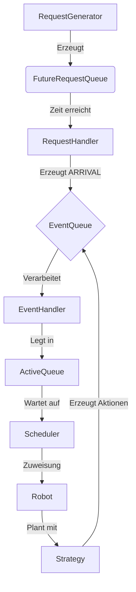

# 📦 Compact Storage Simulation

Eine diskrete Event-Simulation zur Modellierung und Analyse von kompakten Lagersystemen mit automatisierten Robotern.

---

## 🚀 Übersicht

Diese Simulation modelliert ein kompaktes Lager, in dem Kisten (Bins) in Stapeln (Stacks) gelagert werden und in einem Grid (Lager) angeordnet sind. Roboter bearbeiten Anfragen, entnehmen Zielkisten, liefern sie an eine fiktive Pickstation und lagern sie anschließend wieder ein.

Das Projekt ist als **diskrete Event-Simulation (DES)** aufgebaut. Das bedeutet, dass die Simulation nicht kontinuierlich läuft, sondern Ereignisse (Events) zu spezifischen Zeitpunkten verarbeitet.

### 🎯 Ziele der Simulation
- Untersuchung verschiedener **Lagerstrategien** (TopAccess vs. SideAccess).
- Analyse von **Scheduling-Regeln** (FIFO, EDF).
- Bewertung der Systemleistung (Durchsatz, Deadline-Einhaltung, Verspätungen).
- Einfluss von **Hot Items** (häufig nachgefragte Kisten) auf die Effizienz.

---

## 📑 Inhaltsverzeichnis
1. [Grundbegriffe](#-grundbegriffe)
2. [Simulation & Ablauf](#-simulation--ablauf)
3. [Komponenten](#-komponenten)
4. [Konfiguration](#-konfiguration)
5. [Projektstruktur](#-projektstruktur)
6. [Installation & Start](#-installation--start)
7. [Metriken](#-metriken)

---

## 🧩 Grundbegriffe

| Begriff | Beschreibung |
| :--- | :--- |
| **Bin** | Eine Kiste im Lager. Wird nach der Bearbeitung wieder zurückgelegt. |
| **Stack** | Ein Stapel aus mehreren Bins. |
| **Grid** | Das gesamte Lagerlayout, bestehend aus mehreren Stacks. |
| **Request** | Eine Anfrage nach einer Kiste mit Ankunftszeit und Deadline. |
| **Robot** | Führt Aktionen aus (Umlagern, Entnehmen, Einlagern). |

---

## ⚙️ Simulation & Ablauf

### Event-Typen
| Typ | Bedeutung |
| :--- | :--- |
| `ARRIVAL` | Ein Request tritt in das System ein. |
| `ROBOT_ACTION` | Ein Roboter führt eine physische Bewegung aus. |
| `REQUEST_COMPLETE` | Ein Request ist vollständig abgeschlossen. |

### Der Prozess im Überblick



---

## 🛠 Komponenten

### 🏗 SimulationEngine
Das Herzstück der Simulation. Initialisiert das Grid, die Bins, Roboter und die Queues. Sie steuert den gesamten Zeitverlauf.

### 🤖 Scheduler & Strategien
Der **Scheduler** entscheidet, welcher Request als nächstes bearbeitet wird:
- **FIFO** (First In First Out): Der älteste Request zuerst.
- **EDF** (Earliest Deadline First): Der Request mit der dringlichsten Deadline zuerst.

Die **Strategien** planen die physischen Bewegungen:
- `TopAccessStrategy`: Zugriff von oben (Umlagern blockierender Kisten).
- `SideAccessStrategy`: Alternativer Zugriff von der Seite.

### 🚦 ConstraintManager
Prüft vor jeder Aktion, ob diese zulässig ist (z. B. "Ist der Zielstack frei?", "Hat der Roboter Zugriff?"). Bei Konflikten wird die Aktion automatisch verzögert.

---

## 📊 Metriken

Wir messen den Erfolg an der Pickstation zum Zeitpunkt `remove_target`:

- **Deadline Miss Rate**: Wie viele Requests waren zu spät?
- **Average Tardiness**: Durchschnittliche Verspätung.
- **Throughput**: Erfüllte Requests pro Zeiteinheit.

---

## 📂 Projektstruktur

```text
compact-storage-simulation
├── config/             # Konfiguration (SimulationConfig, Initalisierungs-Strategien)
├── events/             # Event-Definition und Typen
├── logging/            # Event-Logs
├── metrics/            # Datensammlung und Auswertung
├── requests_/          # Request-Generierung und Queues
├── simulation/         # Core-Logik (Engine, Handler, Scheduler)
├── state/              # Systemzustand (Grid, Stacks, Bins, Robots)
├── strategies/         # Lagerstrategien (TopAccess, SideAccess)
├── utils/              # Hilfsfunktionen & Visualisierung
├── main.py             # Haupteinstiegspunkt
└── requirements.txt    # Abhängigkeiten
```

---

## 💻 Installation & Start

### Voraussetzungen
- Python 3.8+
- pip

### Setup
1. Repository klonen:
   ```bash
   git clone https://github.com/ihr-repo/compact-storage-simulation.git
   cd compact-storage-simulation
   ```
2. Abhängigkeiten installieren:
   ```bash
   pip install -r requirements.txt
   ```

### Simulation ausführen
Starten Sie die Simulation über die `main.py`:
```bash
python main.py
```

---

## 🔧 Konfiguration

Die Parameter können in `config/simulation_config.py` angepasst werden:

```python
# Beispiel-Konfiguration
self.grid_width = 5
self.grid_depth = 5
self.num_robots = 3
self.scheduler_strategy = "EDF" # oder "FIFO"
```

---

## 💡 Erweiterungsideen
- [ ] Servicezeiten an der Pickstation modellieren.
- [ ] Echte Roboterpfadfindung im Grid.
- [ ] Export der Metriken als CSV/Excel.
- [ ] Interaktive Web-Visualisierung.

---

> Dieses Projekt dient der wissenschaftlichen Untersuchung von Lagerlogistik-Algorithmen im Rahmen einer Masterarbeit an der Universität Hamburg (Institut für Operations Management).
